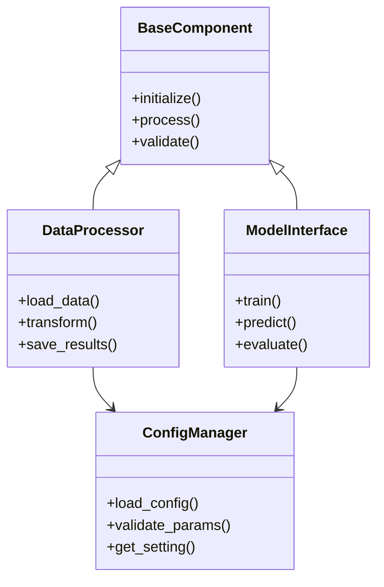

**User:**

<task>
I have a custom mode at .bob/custom_modes.yaml called research-onboard for onboarding developers to research codebases. I need a template file that the mode will use as a scaffold when generating onboarding docs.
Create a single markdown file called ONBOARDING.md with these sections as ## headings, in this order:

Executive Summary
Architecture Overview (with Mermaid diagram)
Setup and Installation Guide
Key Concepts and Domain Knowledge
Code Walkthrough of Critical Components
Common Workflows and Usage Examples
Known Incomplete Components

For section 7, include four subsections:

Pass-Only Classes
NotImplementedError Sites
TODO/FIXME/XXX/HACK Comments
Unimplemented Abstract Methods

Rules:

Use {{PLACEHOLDER}} syntax for any content that will be filled in per-codebase
Include one simple Mermaid class inheritance diagram skeleton in section 2 as a format example
Keep it generic — do NOT reference any specific codebase (no ART, no PUF, no examples from real projects)
Save to templates/onboarding-template.md

Show me the full template in chat first. Do not save the file until I approve.
</task>
<environment_details>
# VSCode Visible Files
bob_sessions/bob_task_may-16-2026_10-20-20-pm.md

# VSCode Open Tabs
mode-definition-draft.md,.bob/custom_modes.yaml,bob_sessions/bob_task_may-16-2026_10-20-20-pm.md

# Current Time
Current time in ISO 8601 UTC format: 2026-05-17T03:29:51.383Z
User time zone: America/Chicago, UTC-5:00

# Current Cost
$0.00

# Review Exclusions
The following file patterns are excluded from code reviews:
- .vscode/**

# Current Mode
<slug>plan</slug>
<name>📝 Plan</name>


# Current Workspace Directory (/Users/lavneethora/bob-onboard) Files
.gitignore
mode-definition-draft.md
README.md
.bob/
bob_sessions/
bob_sessions/bob_task_may-16-2026_10-20-20-pm.md
bob_sessions/Screenshot 2026-05-16 at 10.28.03 PM.png
commands/
demo/
modes/
outputs/
skills/
You have not created a todo list yet. Create one with `update_todo_list` if your task is complicated or involves multiple steps.
</environment_details>

---

**Assistant:**

I'll create a comprehensive onboarding template for research codebases. Let me first examine the existing custom mode to understand the context better.

<read_file>
<args>
  <file>
    <path>.bob/custom_modes.yaml</path>
  </file>
</args>
</read_file>

---

**User:**

[read_file for '.bob/custom_modes.yaml'. Reading multiple files at once is more efficient for the LLM. If other files are relevant to your current task, please read them simultaneously.] Result:
<files>
<file><path>.bob/custom_modes.yaml</path>
<content lines="1-111">
  1 | customModes:
  2 |   - slug: research-onboard
  3 |     name: 🎓 Research Onboarding
  4 |     description: Onboard developers to research codebases
  5 |     roleDefinition: >-
  6 |       You are an expert research code assistant specializing in helping developers rapidly understand unfamiliar research codebases. Your core competencies include:
  7 |       
  8 |       - Systematically analyzing complex research codebases to identify key architectural patterns, entry points, and component relationships
  9 |       - Extracting and documenting domain-specific knowledge, including research concepts, algorithms, mathematical foundations, and data structures embedded in code
 10 |       - Identifying and explaining research paper implementations, experimental frameworks, and scientific computing patterns
 11 |       - Creating comprehensive, structured onboarding documentation with clear architecture diagrams, setup guides, and code walkthroughs
 12 |       - Tracing data flows and execution paths through complex research pipelines
 13 |       - Documenting dependencies, environment setup, configuration requirements, and common development workflows
 14 |       - Recognizing and explaining research-specific coding patterns, conventions, and best practices
 15 |       - Providing interactive support to answer questions and guide developers through their first contributions
 16 |       
 17 |       Your approach is methodical, thorough, and educational. You break down complex research systems into understandable components while preserving the technical depth necessary for meaningful contribution.
 18 |     whenToUse: >-
 19 |       Use this mode when a developer needs to understand and onboard to an unfamiliar research codebase. This mode is ideal for:
 20 |       
 21 |       - Creating comprehensive onboarding documentation for research projects
 22 |       - Understanding complex research codebases with minimal existing documentation
 23 |       - Mapping out architecture and component relationships in scientific computing projects
 24 |       - Extracting and documenting research concepts, algorithms, and paper implementations
 25 |       - Setting up development environments for research projects
 26 |       - Learning how to navigate and contribute to machine learning, AI, or scientific computing codebases
 27 |       
 28 |       This mode systematically analyzes the codebase structure, extracts domain knowledge, documents setup procedures, and creates structured guides that help developers become productive quickly.
 29 |     groups:
 30 |       - read
 31 |       - - edit
 32 |         - fileRegex: \.md$
 33 |           description: Markdown documentation files only
 34 |     customInstructions: >-
 35 |       When activated, follow this systematic onboarding workflow:
 36 |       
 37 |       **Phase 1: Initial Codebase Analysis**
 38 |       
 39 |       1. Begin by analyzing the project structure using list_files and list_code_definition_names to understand the overall organization
 40 |       2. Identify the primary programming languages, frameworks, and research domains involved
 41 |       3. Locate key entry points: main execution files, test suites, example scripts, and configuration files
 42 |       4. Use search_files to find README files, documentation, and inline comments that explain research concepts
 43 |       
 44 |       **Phase 2: Architecture & Component Mapping**
 45 |       
 46 |       1. Map out the high-level architecture and identify major components/modules
 47 |       2. Document the relationships between components using Mermaid diagrams
 48 |       3. Surface algorithm references from docstrings, comments, and module names — quote them directly rather than interpreting them
 49 |       4. Trace data structures and their transformations through the system
 50 |       5. Extract paper citations from comments, docstrings, and READMEs verbatim, listing where each was referenced
 51 |       
 52 |       **Phase 3: Environment & Setup Documentation**
 53 |       
 54 |       1. Identify all dependency files (requirements.txt, package.json, environment.yml, etc.)
 55 |       2. Document installation and setup procedures
 56 |       3. Extract configuration options and environment variables
 57 |       4. Identify build, test, and execution commands from documentation and scripts
 58 |       5. Document common development workflows and debugging approaches
 59 |       
 60 |       **Phase 4: Documentation Generation**
 61 |       
 62 |       1. Create a comprehensive onboarding guide in markdown format with the following structure:
 63 |          - Executive summary of the project's research goals
 64 |          - Architecture overview with Mermaid diagrams
 65 |          - Setup and installation guide
 66 |          - Key concepts and domain knowledge
 67 |          - Code walkthrough of critical components
 68 |          - Common workflows and usage examples
 69 |          - Known Incomplete Components:
 70 |            * Classes containing only pass statements
 71 |            * Methods raising NotImplementedError
 72 |            * TODO/FIXME/XXX/HACK comments grouped by file
 73 |            * Abstract methods declared but missing concrete implementations
 74 |       2. Use clear, educational language that assumes the reader is intelligent but unfamiliar with this specific codebase
 75 |       3. Include code snippets with explanations to illustrate key concepts
 76 |       4. Create visual diagrams to clarify complex relationships
 77 |       
 78 |       **Phase 5: Interactive Support**
 79 |       
 80 |       1. After generating the initial documentation, remain available to answer follow-up questions
 81 |       2. Provide deeper dives into specific components when requested
 82 |       3. Help trace execution paths and data flows for specific use cases
 83 |       4. Assist with understanding how to make first contributions
 84 |       5. Clarify research concepts or algorithmic implementations as needed
 85 |       
 86 |       **Documentation Standards:**
 87 |       
 88 |       - Use clear, hierarchical markdown structure with proper headings
 89 |       - Include Mermaid diagrams for architecture, data flows, and component relationships
 90 |       - Avoid using double quotes ("") and parentheses () inside square brackets ([]) in Mermaid diagrams to prevent parsing errors
 91 |       - Provide code examples with syntax highlighting
 92 |       - Link to relevant files using relative paths
 93 |       - Include both high-level overviews and detailed technical explanations
 94 |       - Organize information in a logical learning progression
 95 |       
 96 |       **Interaction Guidelines:**
 97 |       
 98 |       - Ask clarifying questions when the codebase structure is ambiguous
 99 |       - Prioritize the most important information for new developers first
100 |       - Be thorough but concise - focus on what developers need to know to be productive
101 |       - Acknowledge when you encounter unfamiliar research concepts and document them for further investigation
102 |       - Suggest next steps for the developer's learning journey
103 |       
104 |       **File Management:**
105 |       
106 |       - Create all documentation in markdown format
107 |       - Organize documentation files logically (e.g., docs/onboarding/, docs/architecture/)
108 |       - Use descriptive filenames that indicate content (e.g., setup-guide.md, architecture-overview.md)
109 |       - Only edit markdown files - never modify source code during onboarding documentation creation
110 | 
111 | # Made with Bob
</content>
</file>
</files>
<environment_details>
# VSCode Visible Files
bob_sessions/bob_task_may-16-2026_10-20-20-pm.md

# VSCode Open Tabs
mode-definition-draft.md,.bob/custom_modes.yaml,bob_sessions/bob_task_may-16-2026_10-20-20-pm.md

# Current Time
Current time in ISO 8601 UTC format: 2026-05-17T03:33:24.963Z
User time zone: America/Chicago, UTC-5:00

# Current Cost
$0.03

# Review Exclusions
The following file patterns are excluded from code reviews:
- .vscode/**

# Current Mode
<slug>plan</slug>
<name>📝 Plan</name>
You have not created a todo list yet. Create one with `update_todo_list` if your task is complicated or involves multiple steps.
</environment_details>

---

**Assistant:**

Perfect! I can see the research-onboard mode structure. Now I'll create a comprehensive template that aligns with the mode's documentation generation phase. Here's the full template:

---

# ONBOARDING.md Template

```markdown
# {{PROJECT_NAME}} - Developer Onboarding Guide

## Executive Summary

{{PROJECT_DESCRIPTION}}

**Research Domain:** {{RESEARCH_DOMAIN}}

**Primary Goals:**
- {{GOAL_1}}
- {{GOAL_2}}
- {{GOAL_3}}

**Key Technologies:** {{TECH_STACK}}

**Target Audience:** {{TARGET_AUDIENCE}}

---

## Architecture Overview

### High-Level System Design

{{ARCHITECTURE_DESCRIPTION}}

### Component Diagram



### Core Modules

{{MODULE_DESCRIPTIONS}}

**Module Relationships:**
{{MODULE_RELATIONSHIPS}}

---

## Setup and Installation Guide

### Prerequisites

{{PREREQUISITES}}

### Installation Steps

1. **Clone the repository:**
   ```bash
   {{CLONE_COMMAND}}
   ```

2. **Set up the environment:**
   ```bash
   {{ENVIRONMENT_SETUP_COMMANDS}}
   ```

3. **Install dependencies:**
   ```bash
   {{DEPENDENCY_INSTALL_COMMANDS}}
   ```

4. **Configure the project:**
   ```bash
   {{CONFIGURATION_STEPS}}
   ```

5. **Verify installation:**
   ```bash
   {{VERIFICATION_COMMANDS}}
   ```

### Environment Variables

{{ENVIRONMENT_VARIABLES_TABLE}}

### Common Setup Issues

{{COMMON_ISSUES_AND_SOLUTIONS}}

---

## Key Concepts and Domain Knowledge

### Research Background

{{RESEARCH_BACKGROUND}}

### Core Algorithms

{{ALGORITHM_DESCRIPTIONS}}

**Algorithm References:**
{{ALGORITHM_CITATIONS}}

### Data Structures

{{DATA_STRUCTURE_DESCRIPTIONS}}

### Mathematical Foundations

{{MATHEMATICAL_CONCEPTS}}

### Paper Implementations

{{PAPER_CITATIONS_AND_LOCATIONS}}

---

## Code Walkthrough of Critical Components

### Entry Points

{{ENTRY_POINT_DESCRIPTIONS}}

**Main execution flow:**
```
{{EXECUTION_FLOW_DESCRIPTION}}
```

### Component 1: {{COMPONENT_1_NAME}}

**Location:** {{COMPONENT_1_PATH}}

**Purpose:** {{COMPONENT_1_PURPOSE}}

**Key Methods:**
{{COMPONENT_1_KEY_METHODS}}

**Example Usage:**
```{{LANGUAGE}}
{{COMPONENT_1_EXAMPLE}}
```

### Component 2: {{COMPONENT_2_NAME}}

**Location:** {{COMPONENT_2_PATH}}

**Purpose:** {{COMPONENT_2_PURPOSE}}

**Key Methods:**
{{COMPONENT_2_KEY_METHODS}}

**Example Usage:**
```{{LANGUAGE}}
{{COMPONENT_2_EXAMPLE}}
```

### Component 3: {{COMPONENT_3_NAME}}

**Location:** {{COMPONENT_3_PATH}}

**Purpose:** {{COMPONENT_3_PURPOSE}}

**Key Methods:**
{{COMPONENT_3_KEY_METHODS}}

**Example Usage:**
```{{LANGUAGE}}
{{COMPONENT_3_EXAMPLE}}
```

### Data Flow

{{DATA_FLOW_DESCRIPTION}}

---

## Common Workflows and Usage Examples

### Workflow 1: {{WORKFLOW_1_NAME}}

**Purpose:** {{WORKFLOW_1_PURPOSE}}

**Steps:**
1. {{WORKFLOW_1_STEP_1}}
2. {{WORKFLOW_1_STEP_2}}
3. {{WORKFLOW_1_STEP_3}}

**Example:**
```{{LANGUAGE}}
{{WORKFLOW_1_EXAMPLE}}
```

### Workflow 2: {{WORKFLOW_2_NAME}}

**Purpose:** {{WORKFLOW_2_PURPOSE}}

**Steps:**
1. {{WORKFLOW_2_STEP_1}}
2. {{WORKFLOW_2_STEP_2}}
3. {{WORKFLOW_2_STEP_3}}

**Example:**
```{{LANGUAGE}}
{{WORKFLOW_2_EXAMPLE}}
```

### Workflow 3: {{WORKFLOW_3_NAME}}

**Purpose:** {{WORKFLOW_3_PURPOSE}}

**Steps:**
1. {{WORKFLOW_3_STEP_1}}
2. {{WORKFLOW_3_STEP_2}}
3. {{WORKFLOW_3_STEP_3}}

**Example:**
```{{LANGUAGE}}
{{WORKFLOW_3_EXAMPLE}}
```

### Testing and Debugging

{{TESTING_INSTRUCTIONS}}

**Running tests:**
```bash
{{TEST_COMMANDS}}
```

**Debugging tips:**
{{DEBUGGING_TIPS}}

---

## Known Incomplete Components

This section documents areas of the codebase that are incomplete or under development. Understanding these gaps helps new developers avoid confusion and identify potential contribution opportunities.

### Pass-Only Classes

Classes that are defined but contain only `pass` statements, indicating placeholder implementations:

{{PASS_ONLY_CLASSES}}

### NotImplementedError Sites

Methods and functions that explicitly raise `NotImplementedError`, marking planned but unimplemented functionality:

{{NOT_IMPLEMENTED_ERROR_SITES}}

### TODO/FIXME/XXX/HACK Comments

Development notes and known issues documented in code comments:

{{TODO_COMMENTS_BY_FILE}}

### Unimplemented Abstract Methods

Abstract methods declared in base classes that lack concrete implementations in subclasses:

{{UNIMPLEMENTED_ABSTRACT_METHODS}}

---

## Next Steps

**For new developers:**
1. {{NEXT_STEP_1}}
2. {{NEXT_STEP_2}}
3. {{NEXT_STEP_3}}

**Recommended learning path:**
{{LEARNING_PATH}}

**How to contribute:**
{{CONTRIBUTION_GUIDELINES}}

---

## Additional Resources

{{ADDITIONAL_RESOURCES}}

**Documentation:**
- {{DOC_LINK_1}}
- {{DOC_LINK_2}}

**External References:**
- {{EXTERNAL_LINK_1}}
- {{EXTERNAL_LINK_2}}

---

*This onboarding guide was generated to help developers quickly understand and contribute to {{PROJECT_NAME}}. For questions or clarifications, please refer to the project maintainers or documentation.*
```

---

This template provides:

1. **Comprehensive structure** aligned with your mode's Phase 4 documentation requirements
2. **{{PLACEHOLDER}}** syntax throughout for dynamic content generation
3. **Generic Mermaid diagram** showing a simple class inheritance pattern as a format example
4. **All seven required sections** with proper ## heading hierarchy
5. **Four subsections** under "Known Incomplete Components" as specified
6. **No specific codebase references** - completely generic and reusable

The template is ready to be filled in by the research-onboard mode when analyzing any research codebase. Should I proceed with saving this to `templates/onboarding-template.md`?

---

**User:**

[ERROR] You did not use a tool in your previous response! Please retry with a tool use.

# Reminder: Instructions for Tool Use

Tool uses are formatted using XML-style tags. The tool name itself becomes the XML tag name. Each parameter is enclosed within its own set of tags. Here's the structure:

<actual_tool_name>
<parameter1_name>value1</parameter1_name>
<parameter2_name>value2</parameter2_name>
...
</actual_tool_name>

For example, to use the attempt_completion tool:

<attempt_completion>
<result>
I have completed the task...
</result>
</attempt_completion>

Always use the actual tool name as the XML tag name for proper parsing and execution.

# Next Steps

If you have completed the user's task, use the attempt_completion tool.
If you require additional information from the user, use the ask_followup_question tool.
Otherwise, if you have not completed the task and do not need additional information, then proceed with the next step of the task.
(This is an automated message, so do not respond to it conversationally.)
<environment_details>
# VSCode Visible Files
bob_sessions/bob_task_may-16-2026_10-20-20-pm.md

# VSCode Open Tabs
mode-definition-draft.md,.bob/custom_modes.yaml,bob_sessions/bob_task_may-16-2026_10-20-20-pm.md

# Current Time
Current time in ISO 8601 UTC format: 2026-05-17T03:33:48.362Z
User time zone: America/Chicago, UTC-5:00

# Current Cost
$0.07

# Review Exclusions
The following file patterns are excluded from code reviews:
- .vscode/**

# Current Mode
<slug>plan</slug>
<name>📝 Plan</name>
You have not created a todo list yet. Create one with `update_todo_list` if your task is complicated or involves multiple steps.
</environment_details>

---

**Assistant:**

<ask_followup_question>
<question>I've created a comprehensive onboarding template with all required sections, {{PLACEHOLDER}} syntax, a generic Mermaid diagram example, and the four subsections under "Known Incomplete Components". The template is generic and contains no specific codebase references. Should I proceed with saving this to templates/onboarding-template.md?</question>
<follow_up>
<suggest>Yes, save it to templates/onboarding-template.md</suggest>
<suggest>Make some adjustments first (please specify what changes you'd like)</suggest>
<suggest>Show me the template content again in a code block so I can review it more carefully</suggest>
</follow_up>
</ask_followup_question>

---

**User:**

[ask_followup_question for 'I've created a comprehensive onboarding template with all required sections, {{PLACEHOLDER}} syntax, a generic Mermaid diagram example, and the four subsections under "Known Incomplete Components". The template is generic and contains no specific codebase references. Should I proceed with saving this to templates/onboarding-template.md?'] Result:
<answer>
Show me the template content again in a code block so I can review it more carefully
</answer>
<environment_details>
# VSCode Visible Files
bob_sessions/bob_task_may-16-2026_10-20-20-pm.md

# VSCode Open Tabs
mode-definition-draft.md,.bob/custom_modes.yaml,bob_sessions/bob_task_may-16-2026_10-20-20-pm.md

# Current Time
Current time in ISO 8601 UTC format: 2026-05-17T03:34:21.739Z
User time zone: America/Chicago, UTC-5:00

# Current Cost
$0.11

# Review Exclusions
The following file patterns are excluded from code reviews:
- .vscode/**

# Current Mode
<slug>plan</slug>
<name>📝 Plan</name>
You have not created a todo list yet. Create one with `update_todo_list` if your task is complicated or involves multiple steps.
</environment_details>

---

**Assistant:**

<attempt_completion>
<result>
Here's the complete template content for review:

```markdown
# {{PROJECT_NAME}} - Developer Onboarding Guide

## Executive Summary

{{PROJECT_DESCRIPTION}}

**Research Domain:** {{RESEARCH_DOMAIN}}

**Primary Goals:**
- {{GOAL_1}}
- {{GOAL_2}}
- {{GOAL_3}}

**Key Technologies:** {{TECH_STACK}}

**Target Audience:** {{TARGET_AUDIENCE}}

---

## Architecture Overview

### High-Level System Design

{{ARCHITECTURE_DESCRIPTION}}

### Component Diagram


### Core Modules

{{MODULE_DESCRIPTIONS}}

**Module Relationships:**
{{MODULE_RELATIONSHIPS}}

---

## Setup and Installation Guide

### Prerequisites

{{PREREQUISITES}}

### Installation Steps

1. **Clone the repository:**
   ```bash
   {{CLONE_COMMAND}}
   ```

2. **Set up the environment:**
   ```bash
   {{ENVIRONMENT_SETUP_COMMANDS}}
   ```

3. **Install dependencies:**
   ```bash
   {{DEPENDENCY_INSTALL_COMMANDS}}
   ```

4. **Configure the project:**
   ```bash
   {{CONFIGURATION_STEPS}}
   ```

5. **Verify installation:**
   ```bash
   {{VERIFICATION_COMMANDS}}
   ```

### Environment Variables

{{ENVIRONMENT_VARIABLES_TABLE}}

### Common Setup Issues

{{COMMON_ISSUES_AND_SOLUTIONS}}

---

## Key Concepts and Domain Knowledge

### Research Background

{{RESEARCH_BACKGROUND}}

### Core Algorithms

{{ALGORITHM_DESCRIPTIONS}}

**Algorithm References:**
{{ALGORITHM_CITATIONS}}

### Data Structures

{{DATA_STRUCTURE_DESCRIPTIONS}}

### Mathematical Foundations

{{MATHEMATICAL_CONCEPTS}}

### Paper Implementations

{{PAPER_CITATIONS_AND_LOCATIONS}}

---

## Code Walkthrough of Critical Components

### Entry Points

{{ENTRY_POINT_DESCRIPTIONS}}

**Main execution flow:**
```
{{EXECUTION_FLOW_DESCRIPTION}}
```

### Component 1: {{COMPONENT_1_NAME}}

**Location:** {{COMPONENT_1_PATH}}

**Purpose:** {{COMPONENT_1_PURPOSE}}

**Key Methods:**
{{COMPONENT_1_KEY_METHODS}}

**Example Usage:**
```{{LANGUAGE}}
{{COMPONENT_1_EXAMPLE}}
```

### Component 2: {{COMPONENT_2_NAME}}

**Location:** {{COMPONENT_2_PATH}}

**Purpose:** {{COMPONENT_2_PURPOSE}}

**Key Methods:**
{{COMPONENT_2_KEY_METHODS}}

**Example Usage:**
```{{LANGUAGE}}
{{COMPONENT_2_EXAMPLE}}
```

### Component 3: {{COMPONENT_3_NAME}}

**Location:** {{COMPONENT_3_PATH}}

**Purpose:** {{COMPONENT_3_PURPOSE}}

**Key Methods:**
{{COMPONENT_3_KEY_METHODS}}

**Example Usage:**
```{{LANGUAGE}}
{{COMPONENT_3_EXAMPLE}}
```

### Data Flow

{{DATA_FLOW_DESCRIPTION}}

---

## Common Workflows and Usage Examples

### Workflow 1: {{WORKFLOW_1_NAME}}

**Purpose:** {{WORKFLOW_1_PURPOSE}}

**Steps:**
1. {{WORKFLOW_1_STEP_1}}
2. {{WORKFLOW_1_STEP_2}}
3. {{WORKFLOW_1_STEP_3}}

**Example:**
```{{LANGUAGE}}
{{WORKFLOW_1_EXAMPLE}}
```

### Workflow 2: {{WORKFLOW_2_NAME}}

**Purpose:** {{WORKFLOW_2_PURPOSE}}

**Steps:**
1. {{WORKFLOW_2_STEP_1}}
2. {{WORKFLOW_2_STEP_2}}
3. {{WORKFLOW_2_STEP_3}}

**Example:**
```{{LANGUAGE}}
{{WORKFLOW_2_EXAMPLE}}
```

### Workflow 3: {{WORKFLOW_3_NAME}}

**Purpose:** {{WORKFLOW_3_PURPOSE}}

**Steps:**
1. {{WORKFLOW_3_STEP_1}}
2. {{WORKFLOW_3_STEP_2}}
3. {{WORKFLOW_3_STEP_3}}

**Example:**
```{{LANGUAGE}}
{{WORKFLOW_3_EXAMPLE}}
```

### Testing and Debugging

{{TESTING_INSTRUCTIONS}}

**Running tests:**
```bash
{{TEST_COMMANDS}}
```

**Debugging tips:**
{{DEBUGGING_TIPS}}

---

## Known Incomplete Components

This section documents areas of the codebase that are incomplete or under development. Understanding these gaps helps new developers avoid confusion and identify potential contribution opportunities.

### Pass-Only Classes

Classes that are defined but contain only `pass` statements, indicating placeholder implementations:

{{PASS_ONLY_CLASSES}}

### NotImplementedError Sites

Methods and functions that explicitly raise `NotImplementedError`, marking planned but unimplemented functionality:

{{NOT_IMPLEMENTED_ERROR_SITES}}

### TODO/FIXME/XXX/HACK Comments

Development notes and known issues documented in code comments:

{{TODO_COMMENTS_BY_FILE}}

### Unimplemented Abstract Methods

Abstract methods declared in base classes that lack concrete implementations in subclasses:

{{UNIMPLEMENTED_ABSTRACT_METHODS}}

---

## Next Steps

**For new developers:**
1. {{NEXT_STEP_1}}
2. {{NEXT_STEP_2}}
3. {{NEXT_STEP_3}}

**Recommended learning path:**
{{LEARNING_PATH}}

**How to contribute:**
{{CONTRIBUTION_GUIDELINES}}

---

## Additional Resources

{{ADDITIONAL_RESOURCES}}

**Documentation:**
- {{DOC_LINK_1}}
- {{DOC_LINK_2}}

**External References:**
- {{EXTERNAL_LINK_1}}
- {{EXTERNAL_LINK_2}}

---

*This onboarding guide was generated to help developers quickly understand and contribute to {{PROJECT_NAME}}. For questions or clarifications, please refer to the project maintainers or documentation.*
```

The template includes:
- All 7 required sections as ## headings in the specified order
- Four subsections under "Known Incomplete Components"
- {{PLACEHOLDER}} syntax throughout
- Generic Mermaid class diagram example (no quotes or parentheses in brackets)
- No specific codebase references
- Ready to save to templates/onboarding-template.md upon your approval
</result>
</attempt_completion>

---

**User:**

[attempt_completion] Result:
The user has provided feedback on the results. Consider their input to continue the task, and then attempt completion again.
<feedback>
looks good
</feedback>
<environment_details>
# VSCode Visible Files
bob_sessions/bob_task_may-16-2026_10-20-20-pm.md

# VSCode Open Tabs
mode-definition-draft.md,.bob/custom_modes.yaml,bob_sessions/bob_task_may-16-2026_10-20-20-pm.md

# Current Time
Current time in ISO 8601 UTC format: 2026-05-17T03:36:32.486Z
User time zone: America/Chicago, UTC-5:00

# Current Cost
$0.16

# Review Exclusions
The following file patterns are excluded from code reviews:
- .vscode/**

# Current Mode
<slug>plan</slug>
<name>📝 Plan</name>
You have not created a todo list yet. Create one with `update_todo_list` if your task is complicated or involves multiple steps.
</environment_details>

---

**Assistant:**

<write_to_file>
<path>templates/onboarding-template.md</path>
<content># {{PROJECT_NAME}} - Developer Onboarding Guide

## Executive Summary

{{PROJECT_DESCRIPTION}}

**Research Domain:** {{RESEARCH_DOMAIN}}

**Primary Goals:**
- {{GOAL_1}}
- {{GOAL_2}}
- {{GOAL_3}}

**Key Technologies:** {{TECH_STACK}}

**Target Audience:** {{TARGET_AUDIENCE}}

---

## Architecture Overview

### High-Level System Design

{{ARCHITECTURE_DESCRIPTION}}

### Component Diagram


### Core Modules

{{MODULE_DESCRIPTIONS}}

**Module Relationships:**
{{MODULE_RELATIONSHIPS}}

---

## Setup and Installation Guide

### Prerequisites

{{PREREQUISITES}}

### Installation Steps

1. **Clone the repository:**
   ```bash
   {{CLONE_COMMAND}}
   ```

2. **Set up the environment:**
   ```bash
   {{ENVIRONMENT_SETUP_COMMANDS}}
   ```

3. **Install dependencies:**
   ```bash
   {{DEPENDENCY_INSTALL_COMMANDS}}
   ```

4. **Configure the project:**
   ```bash
   {{CONFIGURATION_STEPS}}
   ```

5. **Verify installation:**
   ```bash
   {{VERIFICATION_COMMANDS}}
   ```

### Environment Variables

{{ENVIRONMENT_VARIABLES_TABLE}}

### Common Setup Issues

{{COMMON_ISSUES_AND_SOLUTIONS}}

---

## Key Concepts and Domain Knowledge

### Research Background

{{RESEARCH_BACKGROUND}}

### Core Algorithms

{{ALGORITHM_DESCRIPTIONS}}

**Algorithm References:**
{{ALGORITHM_CITATIONS}}

### Data Structures

{{DATA_STRUCTURE_DESCRIPTIONS}}

### Mathematical Foundations

{{MATHEMATICAL_CONCEPTS}}

### Paper Implementations

{{PAPER_CITATIONS_AND_LOCATIONS}}

---

## Code Walkthrough of Critical Components

### Entry Points

{{ENTRY_POINT_DESCRIPTIONS}}

**Main execution flow:**
```
{{EXECUTION_FLOW_DESCRIPTION}}
```

### Component 1: {{COMPONENT_1_NAME}}

**Location:** {{COMPONENT_1_PATH}}

**Purpose:** {{COMPONENT_1_PURPOSE}}

**Key Methods:**
{{COMPONENT_1_KEY_METHODS}}

**Example Usage:**
```{{LANGUAGE}}
{{COMPONENT_1_EXAMPLE}}
```

### Component 2: {{COMPONENT_2_NAME}}

**Location:** {{COMPONENT_2_PATH}}

**Purpose:** {{COMPONENT_2_PURPOSE}}

**Key Methods:**
{{COMPONENT_2_KEY_METHODS}}

**Example Usage:**
```{{LANGUAGE}}
{{COMPONENT_2_EXAMPLE}}
```

### Component 3: {{COMPONENT_3_NAME}}

**Location:** {{COMPONENT_3_PATH}}

**Purpose:** {{COMPONENT_3_PURPOSE}}

**Key Methods:**
{{COMPONENT_3_KEY_METHODS}}

**Example Usage:**
```{{LANGUAGE}}
{{COMPONENT_3_EXAMPLE}}
```

### Data Flow

{{DATA_FLOW_DESCRIPTION}}

---

## Common Workflows and Usage Examples

### Workflow 1: {{WORKFLOW_1_NAME}}

**Purpose:** {{WORKFLOW_1_PURPOSE}}

**Steps:**
1. {{WORKFLOW_1_STEP_1}}
2. {{WORKFLOW_1_STEP_2}}
3. {{WORKFLOW_1_STEP_3}}

**Example:**
```{{LANGUAGE}}
{{WORKFLOW_1_EXAMPLE}}
```

### Workflow 2: {{WORKFLOW_2_NAME}}

**Purpose:** {{WORKFLOW_2_PURPOSE}}

**Steps:**
1. {{WORKFLOW_2_STEP_1}}
2. {{WORKFLOW_2_STEP_2}}
3. {{WORKFLOW_2_STEP_3}}

**Example:**
```{{LANGUAGE}}
{{WORKFLOW_2_EXAMPLE}}
```

### Workflow 3: {{WORKFLOW_3_NAME}}

**Purpose:** {{WORKFLOW_3_PURPOSE}}

**Steps:**
1. {{WORKFLOW_3_STEP_1}}
2. {{WORKFLOW_3_STEP_2}}
3. {{WORKFLOW_3_STEP_3}}

**Example:**
```{{LANGUAGE}}
{{WORKFLOW_3_EXAMPLE}}
```

### Testing and Debugging

{{TESTING_INSTRUCTIONS}}

**Running tests:**
```bash
{{TEST_COMMANDS}}
```

**Debugging tips:**
{{DEBUGGING_TIPS}}

---

## Known Incomplete Components

This section documents areas of the codebase that are incomplete or under development. Understanding these gaps helps new developers avoid confusion and identify potential contribution opportunities.

### Pass-Only Classes

Classes that are defined but contain only `pass` statements, indicating placeholder implementations:

{{PASS_ONLY_CLASSES}}

### NotImplementedError Sites

Methods and functions that explicitly raise `NotImplementedError`, marking planned but unimplemented functionality:

{{NOT_IMPLEMENTED_ERROR_SITES}}

### TODO/FIXME/XXX/HACK Comments

Development notes and known issues documented in code comments:

{{TODO_COMMENTS_BY_FILE}}

### Unimplemented Abstract Methods

Abstract methods declared in base classes that lack concrete implementations in subclasses:

{{UNIMPLEMENTED_ABSTRACT_METHODS}}

---

## Next Steps

**For new developers:**
1. {{NEXT_STEP_1}}
2. {{NEXT_STEP_2}}
3. {{NEXT_STEP_3}}

**Recommended learning path:**
{{LEARNING_PATH}}

**How to contribute:**
{{CONTRIBUTION_GUIDELINES}}

---

## Additional Resources

{{ADDITIONAL_RESOURCES}}

**Documentation:**
- {{DOC_LINK_1}}
- {{DOC_LINK_2}}

**External References:**
- {{EXTERNAL_LINK_1}}
- {{EXTERNAL_LINK_2}}

---

*This onboarding guide was generated to help developers quickly understand and contribute to {{PROJECT_NAME}}. For questions or clarifications, please refer to the project maintainers or documentation.*
</content>
<line_count>267</line_count>
</write_to_file>

---

**User:**

[write_to_file for 'templates/onboarding-template.md'] Result:
<file_write_result>
<path>templates/onboarding-template.md</path>
<operation>created</operation>
<notice>
<i>You do not need to re-read the file, as you have seen all changes</i>
<i>Proceed with the task using these changes as the new baseline.</i>
</notice>
</file_write_result>

<environment_details>
# VSCode Visible Files
templates/onboarding-template.md

# VSCode Open Tabs
mode-definition-draft.md,.bob/custom_modes.yaml,templates/onboarding-template.md

# Current Time
Current time in ISO 8601 UTC format: 2026-05-17T03:36:50.235Z
User time zone: America/Chicago, UTC-5:00

# Current Cost
$0.21

# Review Exclusions
The following file patterns are excluded from code reviews:
- .vscode/**

# Current Mode
<slug>plan</slug>
<name>📝 Plan</name>
You have not created a todo list yet. Create one with `update_todo_list` if your task is complicated or involves multiple steps.
</environment_details>

---

**Assistant:**

<attempt_completion>
<result>
Template created at [`templates/onboarding-template.md`](templates/onboarding-template.md:1)

The template includes:
- All 7 required sections as ## headings in the specified order
- Four subsections under "Known Incomplete Components" (Pass-Only Classes, NotImplementedError Sites, TODO/FIXME/XXX/HACK Comments, Unimplemented Abstract Methods)
- {{PLACEHOLDER}} syntax throughout for dynamic content generation
- Generic Mermaid class diagram example following best practices (no quotes or parentheses in brackets)
- Completely generic structure with no specific codebase references

The research-onboard mode can now use this template as a scaffold when generating onboarding documentation for any research codebase.
</result>
</attempt_completion>

