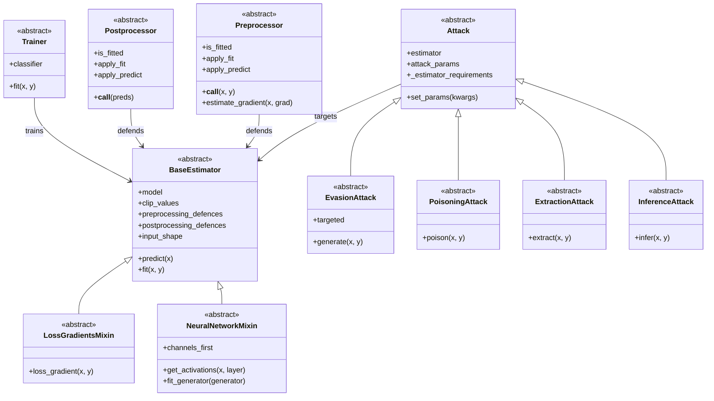

# Adversarial Robustness Toolbox (ART) - Developer Onboarding Guide

## Executive Summary

The Adversarial Robustness Toolbox (ART) is a Python library for Machine Learning Security hosted by the Linux Foundation AI & Data Foundation. ART provides tools that enable developers and researchers to defend and evaluate Machine Learning models and applications against adversarial threats.

**Research Domain:** Machine Learning Security, Adversarial Machine Learning, AI Safety

**Primary Goals:**
- Provide a comprehensive toolkit for evaluating ML model robustness against adversarial attacks
- Enable researchers to implement and test defenses against evasion, poisoning, extraction, and inference attacks
- Support all popular ML frameworks (TensorFlow, Keras, PyTorch, scikit-learn, XGBoost, LightGBM, CatBoost, GPy)
- Handle diverse data types (images, tables, audio, video) and ML tasks (classification, object detection, speech recognition, generation)

**Key Technologies:** Python 3.10+, NumPy, SciPy, scikit-learn, TensorFlow, PyTorch, Keras

**Target Audience:** ML security researchers, adversarial ML practitioners, AI safety engineers, and developers building robust ML systems

---

## Architecture Overview

### High-Level System Design

ART follows a modular architecture built around four core pillars that mirror the adversarial ML threat landscape:

1. **Estimators**: Wrappers around ML models from various frameworks (PyTorch, TensorFlow, Keras, scikit-learn, etc.) that provide a unified interface for attacks and defenses
2. **Attacks**: Implementations of adversarial attack methods organized by threat type (evasion, poisoning, extraction, inference)
3. **Defences**: Countermeasures against attacks, including preprocessors, postprocessors, trainers, and transformers
4. **Metrics & Evaluations**: Tools for measuring model robustness and evaluating defense effectiveness

The library uses abstract base classes to define contracts that concrete implementations must follow, enabling easy extension with new attacks, defenses, or model types.

### Component Diagram



### Core Modules

**art/estimators/**: Model wrappers providing unified interfaces across ML frameworks
- `estimator.py`: Base classes (BaseEstimator, LossGradientsMixin, NeuralNetworkMixin, DecisionTreeMixin)
- `classification/`: Classifiers for various frameworks (PyTorch, TensorFlow, Keras, scikit-learn, XGBoost, LightGBM, CatBoost)
- `object_detection/`: Object detection models (Faster R-CNN, YOLO, DETR)
- `speech_recognition/`: Speech recognition models (DeepSpeech, Espresso)
- `certification/`: Certified defense estimators (randomized smoothing, derandomized smoothing)

**art/attacks/**: Adversarial attack implementations
- `attack.py`: Base attack classes defining the attack interface
- `evasion/`: White-box and black-box evasion attacks (FGSM, PGD, C&W, DeepFool, etc.)
- `poisoning/`: Data poisoning attacks (backdoor attacks, clean-label attacks)
- `extraction/`: Model extraction attacks (copycat, knockoff nets)
- `inference/`: Privacy attacks (membership inference, attribute inference, model inversion)

**art/defences/**: Defense mechanisms against adversarial attacks
- `preprocessor/`: Input preprocessing defenses (feature squeezing, JPEG compression, spatial smoothing)
- `postprocessor/`: Output postprocessing defenses (high confidence, reverse sigmoid)
- `trainer/`: Adversarial training methods (standard, TRADES, AWP)
- `detector/`: Adversarial example detectors
- `transformer/`: Model transformation defenses

**art/metrics/**: Evaluation metrics for robustness assessment
- `metrics.py`: Empirical robustness, CLEVER score, loss sensitivity
- `privacy/`: Privacy leakage metrics

**Module Relationships:**
- Estimators wrap ML models and provide standardized interfaces for attacks and defenses
- Attacks consume Estimators and generate adversarial examples or perform inference
- Defences can be attached to Estimators as preprocessing/postprocessing operations or used for adversarial training
- Metrics evaluate the effectiveness of attacks and defenses on Estimators

---

## Setup and Installation Guide

### Prerequisites

- Python 3.10, 3.11, or 3.12
- pip package manager
- (Optional) CUDA-capable GPU for accelerated deep learning operations
- (Optional) Virtual environment tool (venv, conda, virtualenv)

### Installation Steps

1. **Clone the repository:**
   ```bash
   git clone https://github.com/Trusted-AI/adversarial-robustness-toolbox.git
   cd adversarial-robustness-toolbox
   ```

2. **Set up the environment:**
   ```bash
   # Using venv
   python -m venv art_env
   source art_env/bin/activate  # On Windows: art_env\Scripts\activate
   
   # Or using conda
   conda create -n art_env python=3.10
   conda activate art_env
   ```

3. **Install dependencies:**
   ```bash
   # Minimal installation (core dependencies only)
   pip install -e .
   
   # Install with specific framework support
   pip install -e .[pytorch]        # PyTorch support
   pip install -e .[tensorflow]     # TensorFlow support
   pip install -e .[keras]          # Keras support
   
   # Install with all dependencies (for development)
   pip install -r requirements_test.txt
   
   # Install specific extras
   pip install -e .[pytorch_image]  # PyTorch with image processing
   pip install -e .[tensorflow_audio]  # TensorFlow with audio processing
   ```

4. **Configure the project:**
   ```bash
   # No additional configuration needed for basic usage
   # Optional: Set up TensorBoard for attack visualization
   export TENSORBOARD_LOGDIR=./runs
   ```

5. **Verify installation:**
   ```bash
   # Run a simple test
   python -c "import art; print(art.__version__)"
   
   # Run unit tests (requires test dependencies)
   pytest tests/ -v
   
   # Run a quick example
   python examples/get_started_pytorch.py
   ```

### Environment Variables

| Variable | Description | Default | Required |
|----------|-------------|---------|----------|
| `ART_DATA_PATH` | Path for storing datasets | `~/.art/data` | No |
| `TENSORBOARD_LOGDIR` | TensorBoard log directory | `./runs` | No |
| `CUDA_VISIBLE_DEVICES` | GPU device selection | All GPUs | No |

### Common Setup Issues

**Issue: ImportError for framework-specific modules**
- Solution: Install the appropriate extras, e.g., `pip install adversarial-robustness-toolbox[pytorch]`

**Issue: CUDA out of memory errors**
- Solution: Reduce batch size in attack/defense configurations or use CPU-only mode

**Issue: Slow attack generation**
- Solution: Ensure GPU acceleration is enabled and CUDA is properly installed

**Issue: Version conflicts with existing packages**
- Solution: Use a fresh virtual environment or check `requirements_test.txt` for compatible versions

---

## Key Concepts and Domain Knowledge

### Research Background

Adversarial machine learning studies the vulnerability of ML models to malicious inputs designed to cause misclassification or extract sensitive information. ART addresses four main threat categories:

1. **Evasion Attacks**: Crafting inputs at test time to fool trained models (e.g., adversarial examples)
2. **Poisoning Attacks**: Manipulating training data to compromise model behavior (e.g., backdoor attacks)
3. **Extraction Attacks**: Stealing model functionality or architecture through queries
4. **Inference Attacks**: Extracting sensitive information about training data or model internals

### Core Algorithms

**Fast Gradient Sign Method (FGSM)**
- Location: `art/attacks/evasion/fast_gradient.py`
- Paper: Goodfellow et al., "Explaining and Harnessing Adversarial Examples" (2015)
- Generates adversarial examples by taking a single step in the direction of the loss gradient
- Formula: x_adv = x + ε * sign(∇_x L(θ, x, y))

**Projected Gradient Descent (PGD)**
- Location: `art/attacks/evasion/projected_gradient_descent/`
- Paper: Madry et al., "Towards Deep Learning Models Resistant to Adversarial Attacks" (2018)
- Iterative version of FGSM with projection onto epsilon ball
- Considered one of the strongest first-order attacks

**Carlini & Wagner (C&W) Attack**
- Location: `art/attacks/evasion/carlini.py`
- Paper: Carlini & Wagner, "Towards Evaluating the Robustness of Neural Networks" (2017)
- Optimization-based attack minimizing perturbation while ensuring misclassification
- Uses different distance metrics (L0, L2, L∞)

**DeepFool**
- Location: `art/attacks/evasion/deepfool.py`
- Paper: Moosavi-Dezfooli et al., "DeepFool: a simple and accurate method to fool deep neural networks" (2016)
- Finds minimal perturbation to cross decision boundary

**Adversarial Training**
- Location: `art/defences/trainer/adversarial_trainer.py`
- Trains models on adversarial examples to improve robustness
- Variants include TRADES, AWP, and standard adversarial training

### Algorithm References

The codebase implements algorithms from numerous research papers. Key references found in code:

- **FGSM**: https://arxiv.org/abs/1412.6572 (art/attacks/evasion/fast_gradient.py:22)
- **PGD**: Madry et al. 2018 (art/attacks/evasion/projected_gradient_descent/)
- **C&W**: Carlini & Wagner 2017 (art/attacks/evasion/carlini.py)
- **DeepFool**: Moosavi-Dezfooli et al. 2016 (art/attacks/evasion/deepfool.py)
- **AutoAttack**: Croce & Hein 2020 (art/attacks/evasion/auto_attack.py)
- **HopSkipJump**: Chen et al. 2020 (art/attacks/evasion/hop_skip_jump.py)
- **Backdoor Attacks**: Multiple papers on poisoning attacks (art/attacks/poisoning/)

### Data Structures

**Estimator Wrapper Pattern**
- All ML models are wrapped in ART estimator classes
- Provides unified interface: `predict()`, `fit()`, `loss_gradient()`
- Handles preprocessing/postprocessing pipelines transparently

**Attack Parameters**
- Each attack class defines `attack_params` list specifying configurable parameters
- Common parameters: `eps` (perturbation budget), `norm` (distance metric), `targeted` (attack type)

**Clip Values**
- Tuple `(min, max)` defining valid input range
- Used to ensure adversarial examples remain in valid domain
- Example: `(0.0, 1.0)` for normalized images

### Mathematical Foundations

**Lp Norms**
- L∞ (infinity norm): Maximum absolute change in any dimension
- L2 (Euclidean norm): Total magnitude of perturbation vector
- L1 (Manhattan norm): Sum of absolute changes
- Used to measure perturbation size and constrain attacks

**Loss Functions**
- Cross-entropy loss: Standard for classification tasks
- Carlini-Wagner loss: Custom loss for optimization-based attacks
- Margin loss: Used in some robustness metrics

**Gradient-Based Optimization**
- Most white-box attacks use gradient descent/ascent
- Requires differentiable models (neural networks)
- Black-box attacks use gradient-free methods (genetic algorithms, zeroth-order optimization)

### Paper Implementations

This codebase implements numerous research papers. Key implementations include:

- **Evasion Attacks**: FGSM, PGD, C&W, DeepFool, AutoAttack, HopSkipJump, Boundary Attack, Square Attack, and many more
- **Poisoning Attacks**: BadNets, Clean-Label Backdoor, Sleeper Agent, Feature Collision, Witches' Brew
- **Extraction Attacks**: Copycat CNN, Knockoff Nets, Functionally Equivalent Extraction
- **Inference Attacks**: Membership Inference, Attribute Inference, Model Inversion, Database Reconstruction
- **Defenses**: Adversarial Training, Feature Squeezing, JPEG Compression, Spatial Smoothing, Randomized Smoothing

---

## Code Walkthrough of Critical Components

### Entry Points

**Main Package Initialization**: `art/__init__.py`
- Imports core modules: attacks, defences, estimators, evaluations, metrics, preprocessing
- Sets up logging configuration
- Defines version: `__version__ = "1.20.1"`

**Example Scripts**: `examples/` directory
- `get_started_pytorch.py`: Basic PyTorch workflow with FGSM attack
- `get_started_tensorflow_v2.py`: TensorFlow 2.x example
- `mnist_cnn_fgsm.py`: MNIST classification with FGSM evaluation
- Each example demonstrates: model creation → ART wrapper → attack generation → evaluation

**Main execution flow:**
```
1. Load/create ML model
2. Wrap model in ART estimator (e.g., PyTorchClassifier)
3. Create attack instance with estimator
4. Generate adversarial examples using attack.generate()
5. Evaluate model on clean and adversarial examples
```

### Component 1: BaseEstimator

**Location:** `art/estimators/estimator.py:38-365`

**Purpose:** Abstract base class defining the interface all model wrappers must implement. Provides core functionality for preprocessing, postprocessing, and parameter management.

**Key Methods:**
- `predict(x, **kwargs)`: Perform prediction on input samples
- `fit(x, y, **kwargs)`: Train the model on provided data
- `input_shape`: Property returning shape of one input sample
- `_apply_preprocessing(x, y, fit)`: Apply preprocessing defenses to inputs
- `_apply_postprocessing(preds, fit)`: Apply postprocessing defenses to predictions
- `set_params(**kwargs)`: Update estimator parameters
- `get_params()`: Retrieve all estimator parameters

**Example Usage:**
```python
from art.estimators.classification import PyTorchClassifier
import torch.nn as nn
import torch.optim as optim

# Define model
model = nn.Sequential(
    nn.Conv2d(1, 32, 3),
    nn.ReLU(),
    nn.Flatten(),
    nn.Linear(26*26*32, 10)
)

# Wrap in ART estimator
classifier = PyTorchClassifier(
    model=model,
    loss=nn.CrossEntropyLoss(),
    optimizer=optim.Adam(model.parameters(), lr=0.01),
    input_shape=(1, 28, 28),
    nb_classes=10,
    clip_values=(0.0, 1.0)
)

# Use estimator
predictions = classifier.predict(x_test)
classifier.fit(x_train, y_train, batch_size=64, nb_epochs=10)
```

### Component 2: Attack Base Classes

**Location:** `art/attacks/attack.py:93-559`

**Purpose:** Define abstract interfaces for all attack types. Enforce requirements on target estimators and provide common functionality for parameter management.

**Key Methods:**
- `__init__(estimator, summary_writer)`: Initialize attack with target estimator
- `is_estimator_valid(estimator, requirements)`: Check if estimator satisfies attack requirements
- `set_params(**kwargs)`: Update attack parameters
- `generate(x, y)` (EvasionAttack): Generate adversarial examples
- `poison(x, y)` (PoisoningAttack): Generate poisoned training data
- `extract(x, y)` (ExtractionAttack): Extract model copy
- `infer(x, y)` (InferenceAttack): Infer sensitive information

**Example Usage:**
```python
from art.attacks.evasion import FastGradientMethod
from art.estimators.classification import PyTorchClassifier

# Create attack
attack = FastGradientMethod(
    estimator=classifier,
    eps=0.3,           # Perturbation budget
    norm=np.inf,       # L-infinity norm
    targeted=False,    # Untargeted attack
    batch_size=32
)

# Generate adversarial examples
x_adv = attack.generate(x=x_test)

# Evaluate attack success
predictions_clean = classifier.predict(x_test)
predictions_adv = classifier.predict(x_adv)
accuracy_clean = np.mean(np.argmax(predictions_clean, axis=1) == np.argmax(y_test, axis=1))
accuracy_adv = np.mean(np.argmax(predictions_adv, axis=1) == np.argmax(y_test, axis=1))
print(f"Clean accuracy: {accuracy_clean:.2%}, Adversarial accuracy: {accuracy_adv:.2%}")
```

### Component 3: Preprocessor Defenses

**Location:** `art/defences/preprocessor/preprocessor.py:35-335`

**Purpose:** Abstract base class for input preprocessing defenses that transform data before it reaches the model. Supports gradient estimation for differentiable defenses.

**Key Methods:**
- `__call__(x, y)`: Apply preprocessing to inputs and labels
- `fit(x, y, **kwargs)`: Fit preprocessor parameters if needed
- `estimate_gradient(x, grad)`: Estimate gradient through preprocessing (for BPDA)
- `forward(x, y)` (framework-specific): Apply preprocessing in native framework
- `estimate_forward(x, y)` (framework-specific): Differentiable approximation for gradient computation

**Example Usage:**
```python
from art.defences.preprocessor import JpegCompression
from art.estimators.classification import PyTorchClassifier

# Create preprocessing defense
jpeg_defense = JpegCompression(
    clip_values=(0.0, 1.0),
    quality=50,  # JPEG quality parameter
    apply_fit=False,
    apply_predict=True
)

# Attach to estimator
classifier = PyTorchClassifier(
    model=model,
    loss=criterion,
    optimizer=optimizer,
    input_shape=(3, 32, 32),
    nb_classes=10,
    preprocessing_defences=jpeg_defense
)

# Defense is automatically applied during prediction
predictions = classifier.predict(x_test)  # JPEG compression applied internally
```

### Data Flow

**Training Flow:**
```
Raw Training Data
    ↓
Preprocessing Defenses (if apply_fit=True)
    ↓
Model Training (fit method)
    ↓
Trained Model
```

**Inference Flow:**
```
Raw Input
    ↓
Preprocessing Defenses (if apply_predict=True)
    ↓
Model Prediction
    ↓
Postprocessing Defenses (if apply_predict=True)
    ↓
Final Predictions
```

**Attack Flow:**
```
Clean Examples
    ↓
Attack Algorithm (generate/poison/extract/infer)
    ↓
Query Target Model (via estimator interface)
    ↓
Compute Gradients (if white-box) or Observe Outputs (if black-box)
    ↓
Update Adversarial Examples
    ↓
Repeat until convergence or max iterations
    ↓
Final Adversarial Examples
```

---

## Common Workflows and Usage Examples

### Workflow 1: Evaluating Model Robustness with Evasion Attacks

**Purpose:** Assess how vulnerable a trained classifier is to adversarial examples

**Steps:**
1. Load or train a classifier and wrap it in an ART estimator
2. Create one or more evasion attacks (FGSM, PGD, C&W, etc.)
3. Generate adversarial examples on test data
4. Evaluate model accuracy on both clean and adversarial examples
5. Compare robustness across different attack strengths

**Example:**
```python
import numpy as np
from art.attacks.evasion import FastGradientMethod, ProjectedGradientDescent
from art.estimators.classification import PyTorchClassifier
from art.utils import load_mnist

# Load data
(x_train, y_train), (x_test, y_test), min_val, max_val = load_mnist()
x_train = np.transpose(x_train, (0, 3, 1, 2)).astype(np.float32)
x_test = np.transpose(x_test, (0, 3, 1, 2)).astype(np.float32)

# Create and wrap model
classifier = PyTorchClassifier(
    model=model,
    loss=criterion,
    optimizer=optimizer,
    input_shape=(1, 28, 28),
    nb_classes=10,
    clip_values=(min_val, max_val)
)

# Train model
classifier.fit(x_train, y_train, batch_size=128, nb_epochs=10)

# Evaluate on clean data
predictions_clean = classifier.predict(x_test)
accuracy_clean = np.mean(np.argmax(predictions_clean, axis=1) == np.argmax(y_test, axis=1))
print(f"Clean accuracy: {accuracy_clean:.2%}")

# Test multiple attacks
attacks = {
    'FGSM': FastGradientMethod(classifier, eps=0.3),
    'PGD': ProjectedGradientDescent(classifier, eps=0.3, eps_step=0.01, max_iter=40)
}

for attack_name, attack in attacks.items():
    x_adv = attack.generate(x=x_test)
    predictions_adv = classifier.predict(x_adv)
    accuracy_adv = np.mean(np.argmax(predictions_adv, axis=1) == np.argmax(y_test, axis=1))
    print(f"{attack_name} accuracy: {accuracy_adv:.2%}")
```

### Workflow 2: Implementing Adversarial Training Defense

**Purpose:** Train a robust model by augmenting training data with adversarial examples

**Steps:**
1. Create a classifier wrapped in an ART estimator
2. Define an attack to generate adversarial training examples
3. Use AdversarialTrainer to train the model with adversarial augmentation
4. Evaluate robustness improvement on test set

**Example:**
```python
from art.defences.trainer import AdversarialTrainer
from art.attacks.evasion import ProjectedGradientDescent
from art.estimators.classification import PyTorchClassifier

# Create classifier
classifier = PyTorchClassifier(
    model=model,
    loss=criterion,
    optimizer=optimizer,
    input_shape=(1, 28, 28),
    nb_classes=10,
    clip_values=(0.0, 1.0)
)

# Define attack for training
attack = ProjectedGradientDescent(
    classifier,
    eps=0.3,
    eps_step=0.01,
    max_iter=40,
    targeted=False
)

# Create adversarial trainer
adv_trainer = AdversarialTrainer(classifier, attacks=attack, ratio=0.5)

# Train with adversarial examples
adv_trainer.fit(x_train, y_train, nb_epochs=10, batch_size=128)

# Evaluate robustness
x_test_adv = attack.generate(x=x_test)
predictions = classifier.predict(x_test_adv)
accuracy = np.mean(np.argmax(predictions, axis=1) == np.argmax(y_test, axis=1))
print(f"Adversarial accuracy after training: {accuracy:.2%}")
```

### Workflow 3: Detecting Backdoor Poisoning Attacks

**Purpose:** Identify if a model has been compromised by a backdoor attack during training

**Steps:**
1. Train a model on potentially poisoned data
2. Use Neural Cleanse or Activation Clustering defense to detect backdoors
3. Analyze detected triggers and suspicious samples
4. Optionally retrain on cleaned data

**Example:**
```python
from art.defences.detector.poison import ActivationDefence
from art.estimators.classification import KerasClassifier

# Assume we have a trained model on potentially poisoned data
classifier = KerasClassifier(model=model, clip_values=(0.0, 1.0))

# Create activation defense
defense = ActivationDefence(classifier, x_train, y_train)

# Detect poisoned samples
report, is_clean_lst = defense.detect_poison(nb_clusters=2, nb_dims=10, reduce='PCA')

# Analyze results
poisoned_indices = np.where(is_clean_lst == 0)[0]
print(f"Detected {len(poisoned_indices)} poisoned samples out of {len(x_train)}")

# Get clean data
x_train_clean = x_train[is_clean_lst == 1]
y_train_clean = y_train[is_clean_lst == 1]

# Retrain on clean data
classifier.fit(x_train_clean, y_train_clean, nb_epochs=10, batch_size=128)
```

### Testing and Debugging

**Running tests:**
```bash
# Run all tests
pytest tests/ -v

# Run specific test module
pytest tests/attacks/test_fast_gradient.py -v

# Run tests for specific framework
pytest tests/estimators/classification/test_pytorch.py -v

# Run with coverage
pytest tests/ --cov=art --cov-report=html

# Run specific test function
pytest tests/attacks/test_fast_gradient.py::TestFastGradientMethod::test_generate -v
```

**Debugging tips:**
- Enable verbose logging: `import logging; logging.basicConfig(level=logging.DEBUG)`
- Use TensorBoard for attack visualization: Pass `summary_writer=True` to attack constructors
- Check estimator requirements: Verify your model wrapper satisfies attack requirements using `Attack.is_estimator_valid()`
- Validate input shapes: Ensure data dimensions match `estimator.input_shape`
- Monitor GPU memory: Use smaller batch sizes if encountering OOM errors
- Test with minimal examples: Start with small datasets (e.g., 100 samples) to verify correctness before scaling up
- Check gradient flow: For white-box attacks, verify `estimator.loss_gradient()` returns non-zero gradients
- Use framework-specific implementations: PyTorch and TensorFlow have optimized attack implementations in `projected_gradient_descent/` subdirectories

---

## Known Incomplete Components

This section documents areas of the codebase that are incomplete or under development. Understanding these gaps helps new developers avoid confusion and identify potential contribution opportunities.

### Pass-Only Classes

No classes containing only `pass` statements were found in the codebase. All classes have at least minimal implementations.

### NotImplementedError Sites

Methods and functions that explicitly raise `NotImplementedError`, marking planned but unimplemented functionality:

**Abstract Base Class Methods (Expected)**
- `art/estimators/estimator.py:190`: `BaseEstimator.clone_for_refitting()` - Must be implemented by subclasses
- `art/estimators/estimator.py:248`: `BaseEstimator.predict()` - Abstract method
- `art/estimators/estimator.py:260`: `BaseEstimator.fit()` - Abstract method
- `art/estimators/estimator.py:279`: `BaseEstimator.input_shape` - Abstract property
- `art/estimators/estimator.py:344`: `BaseEstimator.compute_loss()` - Optional method
- `art/estimators/estimator.py:354`: `BaseEstimator.compute_loss_from_predictions()` - Optional method
- `art/estimators/estimator.py:386`: `LossGradientsMixin.loss_gradient()` - Abstract method
- `art/estimators/estimator.py:440`: `NeuralNetworkMixin.predict()` - Abstract method
- `art/estimators/estimator.py:454`: `NeuralNetworkMixin.fit()` - Abstract method
- `art/estimators/estimator.py:493`: `NeuralNetworkMixin.get_activations()` - Abstract method
- `art/estimators/estimator.py:542`: `DecisionTreeMixin.get_trees()` - Abstract method

**Attack Base Classes (Expected)**
- `art/attacks/attack.py:226`: `EvasionAttack.generate()` - Must be implemented by concrete attacks
- `art/attacks/attack.py:261`: `PoisoningAttack.poison()` - Must be implemented by concrete attacks
- `art/attacks/attack.py:291`: `PoisoningAttackGenerator.poison_estimator()` - Must be implemented
- `art/attacks/attack.py:325`: `PoisoningAttackTransformer.poison()` - Must be implemented
- `art/attacks/attack.py:335`: `PoisoningAttackTransformer.poison_estimator()` - Must be implemented
- `art/attacks/attack.py:368`: `PoisoningAttackObjectDetector.poison()` - Must be implemented
- `art/attacks/attack.py:392`: `PoisoningAttackBlackBox.poison()` - Must be implemented
- `art/attacks/attack.py:411`: `PoisoningAttackWhiteBox.poison()` - Must be implemented
- `art/attacks/attack.py:430`: `ExtractionAttack.extract()` - Must be implemented
- `art/attacks/attack.py:455`: `InferenceAttack.infer()` - Must be implemented
- `art/attacks/attack.py:485`: `AttributeInferenceAttack.infer()` - Must be implemented
- `art/attacks/attack.py:517`: `MembershipInferenceAttack.infer()` - Must be implemented
- `art/attacks/attack.py:551`: `ReconstructionAttack.reconstruct()` - Must be implemented

**Defence Base Classes (Expected)**
- `art/defences/preprocessor/preprocessor.py:91`: `Preprocessor.__call__()` - Abstract method
- `art/defences/preprocessor/preprocessor.py:135`: `Preprocessor.forward()` - Abstract method
- `art/defences/preprocessor/preprocessor.py:164`: `PreprocessorPyTorch.forward()` - Abstract method
- `art/defences/preprocessor/preprocessor.py:261`: `PreprocessorTensorFlowV2.forward()` - Abstract method
- `art/defences/postprocessor/postprocessor.py:82`: `Postprocessor.__call__()` - Abstract method
- `art/defences/trainer/trainer.py:52`: `Trainer.fit()` - Abstract method

**Framework-Specific Limitations**
- `art/attacks/poisoning/sleeper_agent_attack.py:172`: SleeperAgentAttack only supports PyTorch
- `art/attacks/poisoning/gradient_matching_attack.py:123`: GradientMatchingAttack only supports PyTorch
- `art/attacks/poisoning/adversarial_embedding_attack.py:187`: AdversarialEmbeddingAttack only supports Keras
- `art/attacks/evasion/shadow_attack.py:248`: ShadowAttack has framework-specific limitations

**Optimization Limitations**
- `art/attacks/evasion/projected_gradient_descent/projected_gradient_descent_pytorch.py:493`: Weighted Lp ball projection not supported for finite norms
- `art/attacks/evasion/projected_gradient_descent/projected_gradient_descent_pytorch.py:511`: Finite norm_p >= 1 not supported with suboptimal=False
- `art/attacks/evasion/projected_gradient_descent/projected_gradient_descent_pytorch.py:515`: norm_p < 1 not supported with suboptimal=False
- `art/attacks/evasion/projected_gradient_descent/projected_gradient_descent_tensorflow_v2.py:346`: Momentum Iterative Attack disabled for TensorFlow (issue #2439)
- `art/utils.py:540`: Weighted Lp ball projection not supported for finite norms
- `art/utils.py:555`: norm_p > 1 (except 2 and inf) not supported with suboptimal=False
- `art/utils.py:560`: norm_p < 1 not supported with suboptimal=False

**Model-Specific Limitations**
- `art/estimators/classification/xgboost.py:135`: Some XGBoost functionality not implemented
- `art/estimators/classification/scikitlearn.py:1244`: SVM sigmoid kernel loss gradients not implemented
- `art/estimators/object_detection/tensorflow_v2_faster_rcnn.py:238`: Training mode doesn't support loss_gradient
- `art/estimators/object_detection/tensorflow_v2_faster_rcnn.py:316`: Training mode doesn't support prediction

### TODO/FIXME/XXX/HACK Comments

Development notes and known issues documented in code comments:

**Performance Optimizations Needed**
- `art/attacks/evasion/imperceptible_asr/imperceptible_asr.py:845`: TODO reduce for loop in masker computation
- `art/attacks/evasion/pixel_threshold.py:1281`: TODO: can be vectorized (parameter scaling)
- `art/attacks/evasion/pixel_threshold.py:1333`: TODO: can be vectorized (mutation)

**Algorithm Improvements**
- `art/defences/detector/poison/activation_defence.py:801`: TODO: address issue where if fewer samples than nb_dims this fails
- `art/attacks/evasion/deepfool.py:118`: TODO compute set of unique labels per batch
- `art/attacks/evasion/brendel_bethge.py:2251`: TODO: Implement more efficient search with breaking condition
- `art/attacks/evasion/brendel_bethge.py:2292`: TODO: only perform forward pass on non-converged samples

**Feature Enhancements**
- `art/defences/detector/evasion/subsetscanning/scanner.py:139`: TODO: some randomizing and only leave in a random number of rows of pvalues
- `art/estimators/poison_mitigation/neural_cleanse/neural_cleanse.py:211`: TODO: explore different values for threshold
- `art/estimators/classification/hugging_face.py:326-329`: TODO: refactor activation defence to not crash if non 2D inputs are provided

**Code Quality**
- `art/attacks/evasion/graphite/graphite_whitebox_pytorch.py:496`: TODO1 (unclear marker)
- `art/attacks/evasion/pixel_threshold.py:495`: TODO: Make the attack compatible with current version of SciPy Optimize

**Commented Out Code**
- `art/metrics/metrics.py:218`: Commented TODO check if following computation is correct

### Unimplemented Abstract Methods

All abstract methods in base classes are properly marked with `@abc.abstractmethod` and raise `NotImplementedError`. Concrete implementations are expected to override these methods. The architecture is well-designed with clear contracts between base classes and implementations.

**Key Extension Points for New Contributions:**
1. New attack types: Inherit from appropriate attack base class (EvasionAttack, PoisoningAttack, etc.)
2. New defenses: Inherit from Preprocessor, Postprocessor, or Trainer
3. New estimators: Inherit from BaseEstimator and appropriate mixins
4. Framework support: Implement framework-specific versions in corresponding modules

---

## Next Steps

**For new developers:**
1. Start with the examples in `examples/` directory to understand basic workflows
2. Read through the architecture overview and base class documentation
3. Run existing tests to verify your environment setup
4. Try modifying an existing attack or defense to understand the codebase structure

**Recommended learning path:**
1. **Week 1**: Understand estimator wrappers and run basic examples
   - Study `art/estimators/estimator.py` and framework-specific implementations
   - Run `examples/get_started_pytorch.py` and `examples/mnist_cnn_fgsm.py`
   - Experiment with different attack parameters

2. **Week 2**: Deep dive into attack implementations
   - Study `art/attacks/attack.py` base classes
   - Examine FGSM and PGD implementations in detail
   - Implement a simple custom attack

3. **Week 3**: Explore defense mechanisms
   - Study preprocessor and postprocessor base classes
   - Understand adversarial training workflow
   - Test different defense combinations

4. **Week 4**: Contribute to the project
   - Identify an incomplete component or TODO item
   - Implement a new attack/defense from a recent paper
   - Add tests and documentation for your contribution

**How to contribute:**
1. Read `CONTRIBUTING.md` for contribution guidelines
2. Follow PEP 8 coding standards
3. Sign off commits with DCO: `git commit -s -m "message"`
4. Provide unit tests with 80%+ coverage for new features
5. Submit pull requests through GitHub
6. Join the Slack channel for discussions: https://ibm-art.slack.com

**Contribution Ideas:**
- Implement attacks from recent papers (check arXiv for adversarial ML papers)
- Add support for new ML frameworks or model types
- Improve performance of existing attacks (vectorization, GPU optimization)
- Enhance documentation with more examples and tutorials
- Address TODO items listed in the Known Incomplete Components section
- Add new evaluation metrics for robustness assessment

---

## Additional Resources

**Documentation:**
- Official Documentation: https://adversarial-robustness-toolbox.readthedocs.io
- GitHub Wiki: https://github.com/Trusted-AI/adversarial-robustness-toolbox/wiki
- API Reference: https://adversarial-robustness-toolbox.readthedocs.io/en/latest/modules/attacks.html
- Examples and Notebooks: `examples/` and `notebooks/` directories in the repository

**External References:**
- ART Paper: Nicolae et al., "Adversarial Robustness Toolbox v1.0.0" (2018)
- Adversarial ML Reading List: https://nicholas.carlini.com/writing/2019/all-adversarial-example-papers.html
- RobustBench Leaderboard: https://robustbench.github.io/
- NIPS 2017 Adversarial Competition: https://www.kaggle.com/c/nips-2017-defense-against-adversarial-attack
- Trustworthy ML Initiative: https://www.trustworthyml.org/

**Community:**
- Slack Channel: https://ibm-art.slack.com (Invitation: https://join.slack.com/t/ibm-art/shared_invite/enQtMzkyOTkyODE4NzM4LTA4NGQ1OTMxMzFmY2Q1MzE1NWI2MmEzN2FjNGNjOGVlODVkZDE0MjA1NTA4OGVkMjVkNmQ4MTY1NmMyOGM5YTg)
- GitHub Issues: https://github.com/Trusted-AI/adversarial-robustness-toolbox/issues
- GitHub Discussions: https://github.com/Trusted-AI/adversarial-robustness-toolbox/discussions

**Related Projects:**
- CleverHans: https://github.com/cleverhans-lab/cleverhans
- Foolbox: https://github.com/bethgelab/foolbox
- Advertorch: https://github.com/BorealisAI/advertorch
- RobustBench: https://github.com/RobustBench/robustbench

---

*This onboarding guide was generated to help developers quickly understand and contribute to the Adversarial Robustness Toolbox. For questions or clarifications, please refer to the project maintainers through GitHub issues or the Slack channel.*