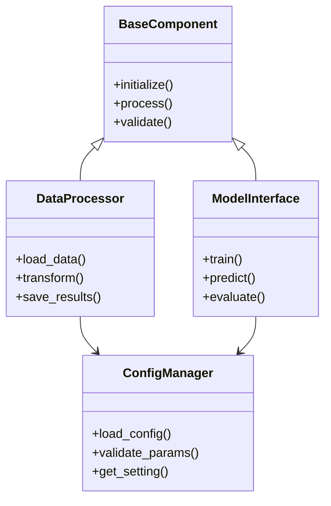

# {{PROJECT_NAME}} - Developer Onboarding Guide

## Executive Summary

{{PROJECT_DESCRIPTION}}

**Research Domain:** {{RESEARCH_DOMAIN}}

**Primary Goals:**
- {{GOAL_1}}
- {{GOAL_2}}
- {{GOAL_3}}

**Key Technologies:** {{TECH_STACK}}

**Target Audience:** {{TARGET_AUDIENCE}}

---

## Architecture Overview

### High-Level System Design

{{ARCHITECTURE_DESCRIPTION}}

### Component Diagram



### Core Modules

{{MODULE_DESCRIPTIONS}}

**Module Relationships:**
{{MODULE_RELATIONSHIPS}}

---

## Setup and Installation Guide

### Prerequisites

{{PREREQUISITES}}

### Installation Steps

1. **Clone the repository:**
   ```bash
   {{CLONE_COMMAND}}
   ```

2. **Set up the environment:**
   ```bash
   {{ENVIRONMENT_SETUP_COMMANDS}}
   ```

3. **Install dependencies:**
   ```bash
   {{DEPENDENCY_INSTALL_COMMANDS}}
   ```

4. **Configure the project:**
   ```bash
   {{CONFIGURATION_STEPS}}
   ```

5. **Verify installation:**
   ```bash
   {{VERIFICATION_COMMANDS}}
   ```

### Environment Variables

{{ENVIRONMENT_VARIABLES_TABLE}}

### Common Setup Issues

{{COMMON_ISSUES_AND_SOLUTIONS}}

---

## Key Concepts and Domain Knowledge

### Research Background

{{RESEARCH_BACKGROUND}}

### Core Algorithms

{{ALGORITHM_DESCRIPTIONS}}

**Algorithm References:**
{{ALGORITHM_CITATIONS}}

### Data Structures

{{DATA_STRUCTURE_DESCRIPTIONS}}

### Mathematical Foundations

{{MATHEMATICAL_CONCEPTS}}

### Paper Implementations

{{PAPER_CITATIONS_AND_LOCATIONS}}

---

## Code Walkthrough of Critical Components

### Entry Points

{{ENTRY_POINT_DESCRIPTIONS}}

**Main execution flow:**
```
{{EXECUTION_FLOW_DESCRIPTION}}
```

### Component 1: {{COMPONENT_1_NAME}}

**Location:** {{COMPONENT_1_PATH}}

**Purpose:** {{COMPONENT_1_PURPOSE}}

**Key Methods:**
{{COMPONENT_1_KEY_METHODS}}

**Example Usage:**
```{{LANGUAGE}}
{{COMPONENT_1_EXAMPLE}}
```

### Component 2: {{COMPONENT_2_NAME}}

**Location:** {{COMPONENT_2_PATH}}

**Purpose:** {{COMPONENT_2_PURPOSE}}

**Key Methods:**
{{COMPONENT_2_KEY_METHODS}}

**Example Usage:**
```{{LANGUAGE}}
{{COMPONENT_2_EXAMPLE}}
```

### Component 3: {{COMPONENT_3_NAME}}

**Location:** {{COMPONENT_3_PATH}}

**Purpose:** {{COMPONENT_3_PURPOSE}}

**Key Methods:**
{{COMPONENT_3_KEY_METHODS}}

**Example Usage:**
```{{LANGUAGE}}
{{COMPONENT_3_EXAMPLE}}
```

### Data Flow

{{DATA_FLOW_DESCRIPTION}}

---

## Common Workflows and Usage Examples

### Workflow 1: {{WORKFLOW_1_NAME}}

**Purpose:** {{WORKFLOW_1_PURPOSE}}

**Steps:**
1. {{WORKFLOW_1_STEP_1}}
2. {{WORKFLOW_1_STEP_2}}
3. {{WORKFLOW_1_STEP_3}}

**Example:**
```{{LANGUAGE}}
{{WORKFLOW_1_EXAMPLE}}
```

### Workflow 2: {{WORKFLOW_2_NAME}}

**Purpose:** {{WORKFLOW_2_PURPOSE}}

**Steps:**
1. {{WORKFLOW_2_STEP_1}}
2. {{WORKFLOW_2_STEP_2}}
3. {{WORKFLOW_2_STEP_3}}

**Example:**
```{{LANGUAGE}}
{{WORKFLOW_2_EXAMPLE}}
```

### Workflow 3: {{WORKFLOW_3_NAME}}

**Purpose:** {{WORKFLOW_3_PURPOSE}}

**Steps:**
1. {{WORKFLOW_3_STEP_1}}
2. {{WORKFLOW_3_STEP_2}}
3. {{WORKFLOW_3_STEP_3}}

**Example:**
```{{LANGUAGE}}
{{WORKFLOW_3_EXAMPLE}}
```

### Testing and Debugging

{{TESTING_INSTRUCTIONS}}

**Running tests:**
```bash
{{TEST_COMMANDS}}
```

**Debugging tips:**
{{DEBUGGING_TIPS}}

---

## Known Incomplete Components

This section documents areas of the codebase that are incomplete or under development. Understanding these gaps helps new developers avoid confusion and identify potential contribution opportunities.

### Pass-Only Classes

Classes that are defined but contain only `pass` statements, indicating placeholder implementations:

{{PASS_ONLY_CLASSES}}

### NotImplementedError Sites

Methods and functions that explicitly raise `NotImplementedError`, marking planned but unimplemented functionality:

{{NOT_IMPLEMENTED_ERROR_SITES}}

### TODO/FIXME/XXX/HACK Comments

Development notes and known issues documented in code comments:

{{TODO_COMMENTS_BY_FILE}}

### Unimplemented Abstract Methods

Abstract methods declared in base classes that lack concrete implementations in subclasses:

{{UNIMPLEMENTED_ABSTRACT_METHODS}}

---

## Next Steps

**For new developers:**
1. {{NEXT_STEP_1}}
2. {{NEXT_STEP_2}}
3. {{NEXT_STEP_3}}

**Recommended learning path:**
{{LEARNING_PATH}}

**How to contribute:**
{{CONTRIBUTION_GUIDELINES}}

---

## Additional Resources

{{ADDITIONAL_RESOURCES}}

**Documentation:**
- {{DOC_LINK_1}}
- {{DOC_LINK_2}}

**External References:**
- {{EXTERNAL_LINK_1}}
- {{EXTERNAL_LINK_2}}

---

*This onboarding guide was generated to help developers quickly understand and contribute to {{PROJECT_NAME}}. For questions or clarifications, please refer to the project maintainers or documentation.*